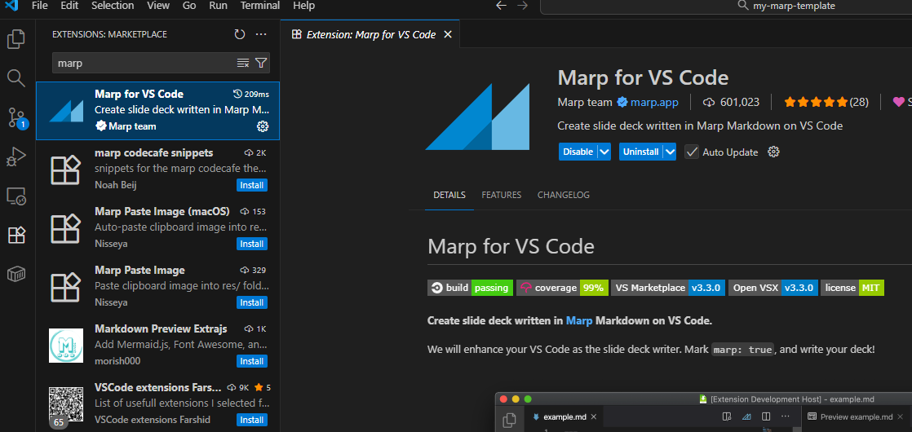
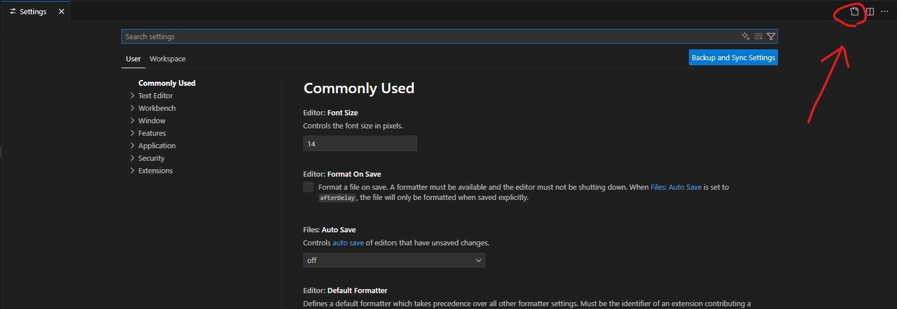
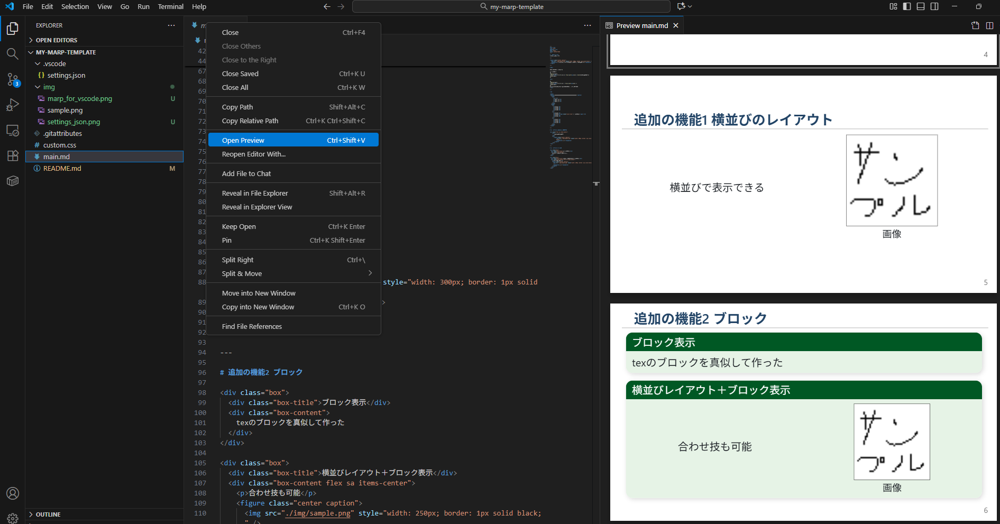
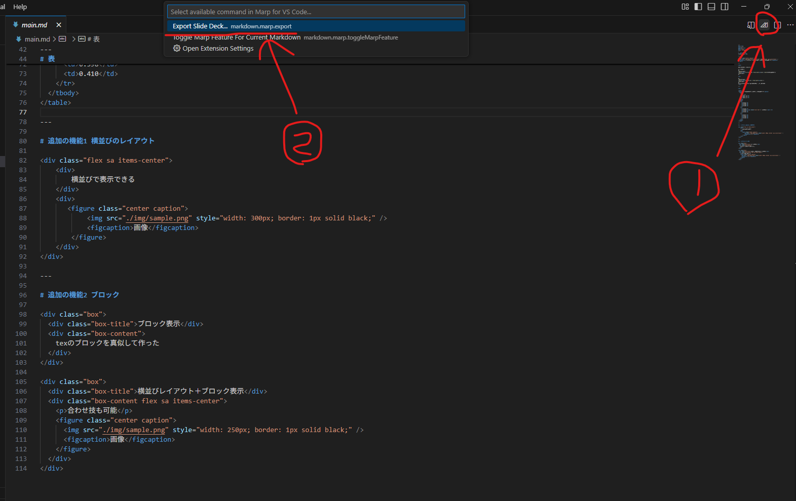

# 概要
mdファイル＋html/cssでスライドを作成することができる Marp (Markdown Presentation Ecosystem) の自作テーマ・テンプレートです．

# 使い方

## 1. 準備

まず，このテンプレートをローカル環境にクローンまたはダウンロードします．
次に，VSCodeの拡張機能マーケットプレイスから **"Marp for VS Code"** をインストールしてください．



### 2. VSCodeの設定

1. `Ctrl + ,` でコマンドパレットを開き，右上のファイルアイコンをクリックして **`settings.json`** を開きます．

   

2. `settings.json` に以下の設定を追記します．これにより，カスタムテーマの適用やPowerPointへのエクスポート設定が有効になります．

   ```json
   {
       // ... 他の設定 ...
   
       // --- 以下を追記 ---
   
       // デフォルトのエクスポート形式をPowerPointに設定
       "markdown.marp.exportType": "pptx",
   
       // エクスポートしたPowerPointファイルを編集可能にする
       "markdown.marp.pptx.editable": "on",
   
       // 使用するカスタムテーマのCSSファイルを指定
       "markdown.marp.themes": [
           "[https://raw.githubusercontent.com/kaisugi/marp-theme-academic/main/themes/academic.css](https://raw.githubusercontent.com/kaisugi/marp-theme-academic/main/themes/academic.css)",
           "./custom.css"
       ],
   
       // Markdown内でのHTMLタグの使用を許可
       "markdown.marp.html": "all",
   
       // エクスポート時にローカルファイルのパスを正しく解決する
       "markdown.marp.strictPathResolutionDuringExport": true
   }
    ```

## 3. スライドの作成とプレビュー
"main.md" ファイルを編集してスライドを作成します． エディタ上で右クリックし，"Open Preview" を選択すると，スライドの見た目をリアルタイムで確認できます．

  

## 4. スライドのエクスポート
"main.md" を開いた状態で，エディタ右上のMarpアイコン（再生ボタンが2つ重なったようなアイコン）をクリックし， "Export Slide Deck..." を選択します． これにより，スライドを PowerPoint (.pptx) や PDF などの形式で出力できます．

  

## 5. タイムアウトの対処法
Marpのエクスポート処理がタイムアウトする場合，以下の方法で対処できます．
### 1. htmlでエクスポートする
HTMLのレンダリングなどを行わないため，タイムアウトが発生しにくいです．
### 2. powershellでタイムアウトを無効にする
powershellを開き，以下のコマンドでタイムアウトを大きくし，VSCodeを再起動する
  - 一時的に無効にする場合
    ```powershell
    $env:PUPPETEER_TIMEOUT = "300000"
    ```
  - 永続的に無効にする場合
    ```powershell
    [System.Environment]::SetEnvironmentVariable("PUPPETEER_TIMEOUT", "300000", "User")
    ```
  - VSCodeでpowershellを開き，以下のコマンドで"300000"が出力されれば設定完了
    ```powershell
    echo $env:PUPPETEER_TIMEOUT
    ```
### 3. Marp cliを入れる
marp cli，日本語フォントをインストールし，以下のコマンドでエクスポートする方法もあります．
若干面倒．
```bash
marp main.md --pdf --theme-set custom.css --allow-local-files --html true
```
[marpのインストール](http://qiita.com/vpkaerun/items/ca8a26e92b8cc9b0cece)
[日本語フォントのインストール例](https://qiita.com/flat35hd99/items/f981b0088a608d6d7974)
